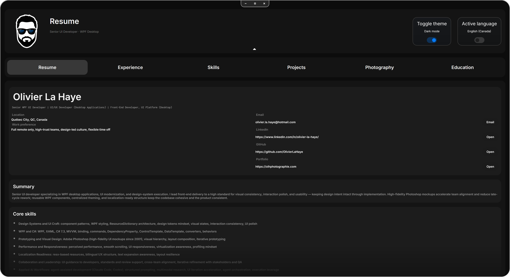
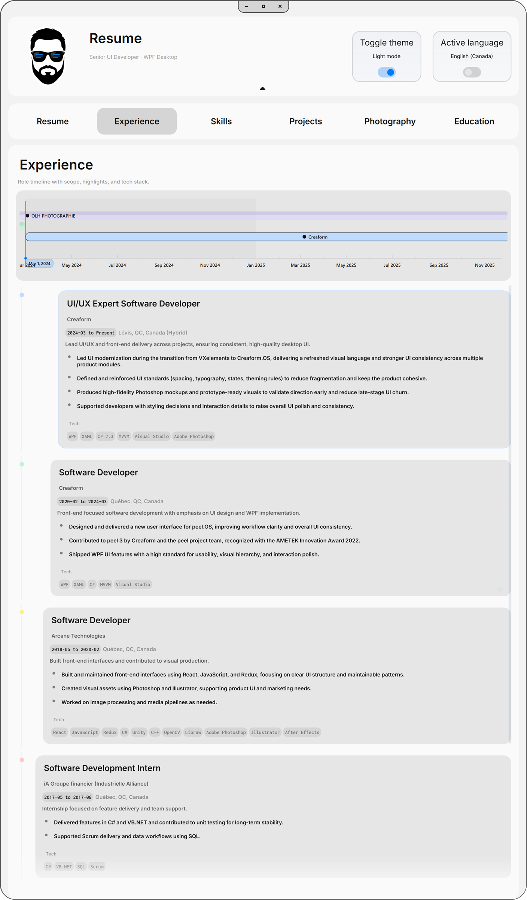
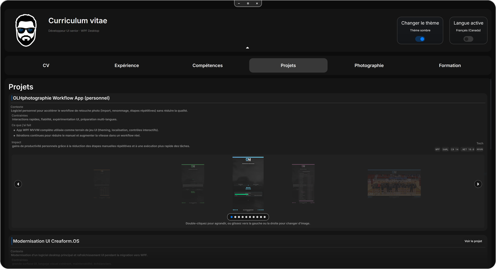
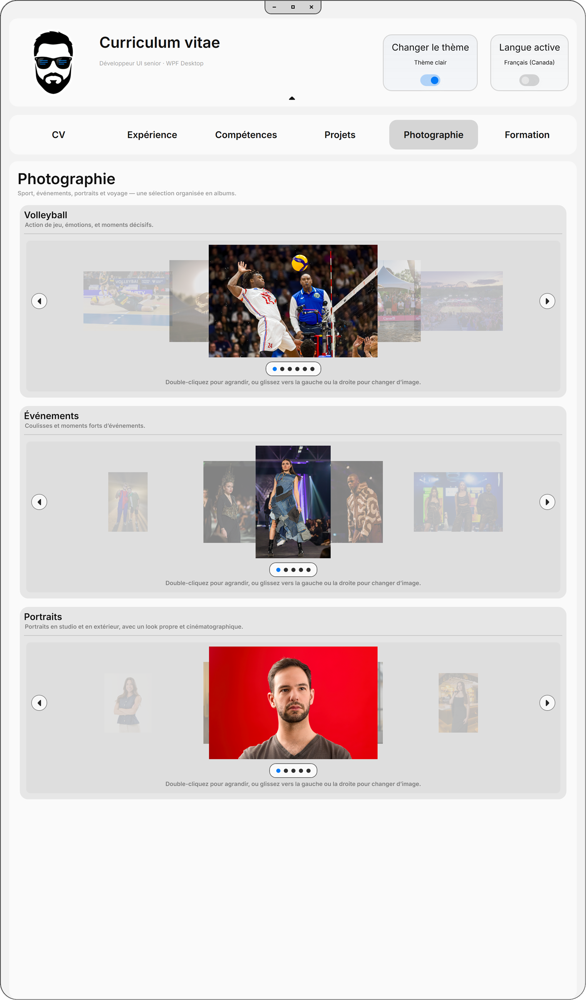
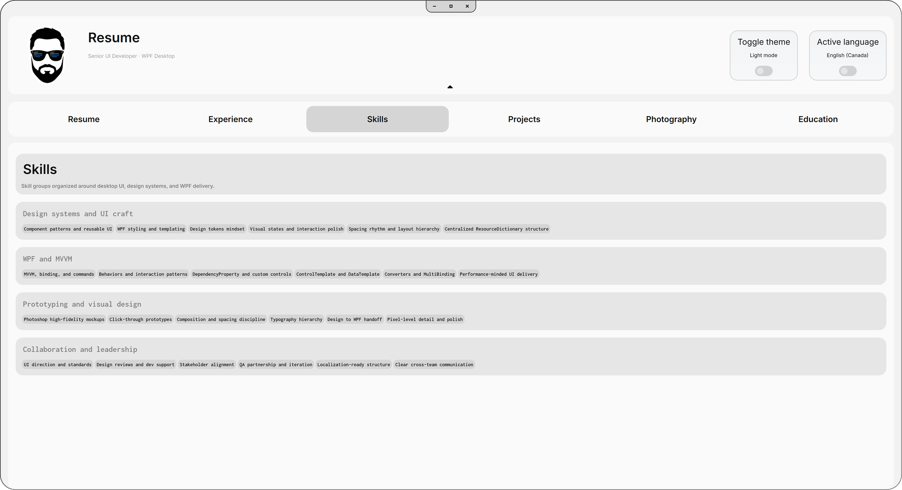
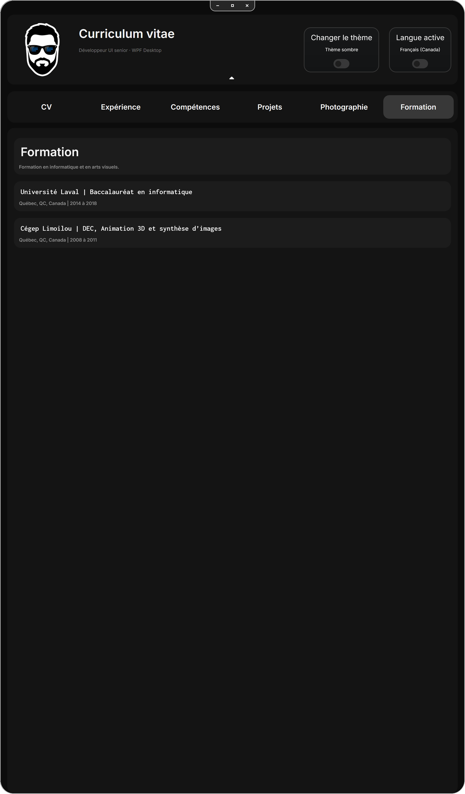

# ResumeApp

A bilingual WPF desktop resume and portfolio that presents a CV like a polished product instead of a static document.

English first. Version française plus bas.



## English

### Why this project is interesting

- It is a real desktop portfolio piece, not a PDF viewer wrapped in a shell.
- The experience page uses a custom timeline with synchronized role cards for a much stronger scan-and-explore flow.
- Light and dark themes, plus English and French UI, are part of the actual product surface.
- The project and photography sections show both software work and visual craft inside the same app.
- The README screenshots are captured from the real application window on both horizontal and vertical 4K setups.

### What the app does

ResumeApp brings together my profile, experience, skills, software projects, photography work, and education in a single Windows desktop application. Visitors can move through dedicated tabs, switch theme and language from the top bar, and explore project and photo galleries without leaving the app.

### Why I built it

I wanted something stronger than “here is my resume as a PDF.” This project lets me demonstrate UI engineering, localization, information hierarchy, interaction polish, and product presentation in one artifact that people can actually explore.

### Additional screenshots

These are window-only captures from the real app, with rounded corners preserved.

#### Experience timeline



English · Light mode · Vertical 4K capture

#### Project case studies



French · Dark mode · Horizontal 4K capture

#### Photography gallery



French · Light mode · Vertical 4K capture

<details>
<summary>More screens</summary>

#### Skills overview



English · Light mode · Horizontal 4K capture

#### Education



French · Dark mode · Vertical 4K capture

</details>

### Tech stack

- .NET 10
- C# 14
- WPF and XAML
- ResourceDictionary-based theming, styling, and animation tokens
- `.resx` localization for `en-CA` and `fr-CA`
- Custom controls for the experience timeline and image carousels
- xUnit tests for view models, services, controls, converters, and helpers

### How to run it locally

Windows is required because this is a WPF desktop application.

```powershell
dotnet build ResumeApp.sln -c Release
dotnet run --project ResumeApp.csproj -c Release
```

If you prefer to launch the built executable directly:

```text
bin/Release/net10.0-windows/ResumeApp.exe
```

The repository already includes `ResxCleaner.exe`, which is used by the project pre-build step.

### Quick evaluation notes

- The best place to start is the overview screen, then the experience timeline, then the projects tab.
- The UI is intentionally bilingual and theme-aware because localization and presentation are part of the point of the project.
- The photography section is there on purpose: it shows visual judgment and presentation craft, not only coding.
- If you are evaluating this as a portfolio piece, focus on shell design, interaction polish, content structure, and the custom timeline control.

## Français (Québec)

### Pourquoi ce projet vaut le détour

- Ce n’est pas un CV PDF déguisé en application.
- L’onglet Expérience repose sur une ligne du temps personnalisée, synchronisée avec les cartes de rôles.
- Les thèmes clair et sombre, ainsi que l’interface bilingue, font partie de l’expérience elle-même.
- Les sections Projets et Photographie montrent à la fois le travail logiciel et le souci de présentation visuelle.
- Les captures du README viennent de la vraie fenêtre de l’application, sur des écrans 4K horizontal et vertical.

### Ce que l’application fait

ResumeApp regroupe mon profil, mon parcours, mes compétences, mes projets logiciels, mon travail photo et ma formation dans une seule application Windows. On peut passer d’un onglet à l’autre, changer le thème et la langue depuis la barre du haut, puis parcourir les projets et les galeries d’images directement dans l’interface.

### Pourquoi je l’ai construite

Je voulais quelque chose de plus parlant que « voici mon CV en PDF ». Ce projet me permet de montrer, dans un seul objet, ma façon d’aborder l’ingénierie UI, la localisation, la hiérarchie visuelle, la finition d’interaction et la présentation produit en WPF.

### Stack technique

- .NET 10
- C# 14
- WPF et XAML
- Dictionnaires de ressources pour les thèmes, les styles et les jetons d’animation
- Localisation `en-CA` et `fr-CA` avec des fichiers `.resx`
- Contrôles sur mesure pour la ligne du temps d’expérience et les carrousels d’images
- Projet de tests xUnit pour les view models, services, contrôles, convertisseurs et helpers

### Lancer le projet localement

Windows est requis, puisque l’application est construite en WPF.

```powershell
dotnet build ResumeApp.sln -c Release
dotnet run --project ResumeApp.csproj -c Release
```

Tu peux aussi lancer directement l’exécutable généré :

```text
bin/Release/net10.0-windows/ResumeApp.exe
```

Le dépôt inclut déjà `ResxCleaner.exe`, utilisé à l’étape de pré-build.

### Points à regarder rapidement

- Commence par l’aperçu, puis passe à la ligne du temps dans l’onglet Expérience, puis aux Projets.
- Le bilinguisme et les thèmes ne sont pas décoratifs : ils font partie de la démonstration.
- La section Photographie est là pour montrer le jugement visuel et la qualité de présentation, pas seulement le code.
- Si tu regardes ce dépôt comme pièce de portfolio, porte surtout attention au shell, à la finition UI, à la structure du contenu et à la ligne du temps personnalisée.
